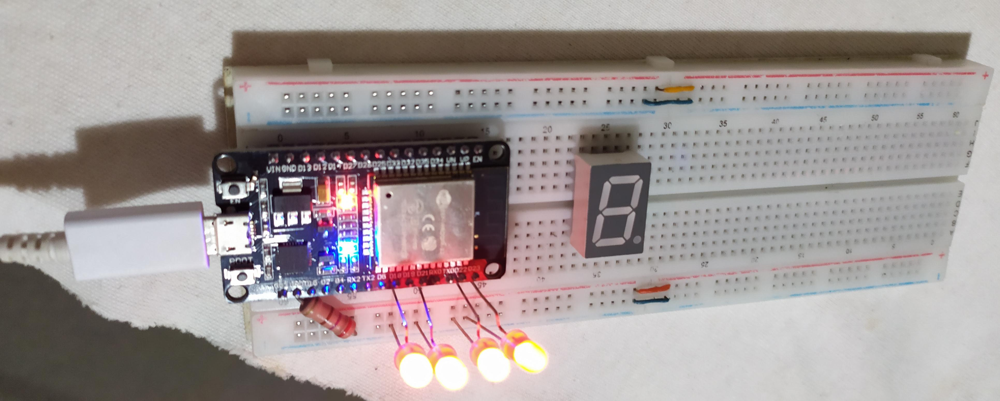
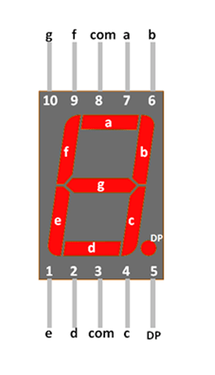

# ESP32-FreeRTOS
Lab 7 Sistemas Operativos 2 - Embedded Systems and Real Time Operating Systems

## Sistemas Operativos de Tiempo Real (RTOS)
Los RTOS son sistemas operativos especiales que deben cumplir con requisitos temporales o **deadlines**. No es necesario que el sistema sea muy rápido, sino que la necesidad principal es la **previsibilidad**. Se emplean en tareas críticas que deben ejecutarse obligatoriamente dentro de una ventana de tiempo determinada.

En este laboratorio se trabaja con **FreeRTOS**, el RTOS más popular al día de la fecha, siendo el mismo un proyecto open source y de fácil acceso. Se implementará en una **placa ESP32**, muy popular por su importante potencia computacional y su reducido precio. La versión específica de la placa usada en este proyecto es **NodeMCU32s**, aunque es aplicable a cualquier ESP32 que cuente con los suficientes pines de propósito general (GPIO) que se utilizan en el proyecto.

## Implementación física
Se investigaron las diferentes maneras de cargar programas en la placa, siendo las más sencillas usando el **IDE Arduino** o usando **[PlatformIO](https://platformio.org)**, esta última es la elegida para el laboratorio ya que simplifica mucho las tareas de subir el programa a la placa y de descargar las librerías necesarias sin demasiadas complicaciones.

Para subir el programa a la placa basta con presionar el botón **(✔) Upload** de PlatformIO o bien ejecutar alguno de estos comandos en la terminal del proyecto:
```
pio run --target upload
```
O, más específicamente para esta placa:
```
pio run --target upload --upload-port /dev/ttyUSB0 --environment nodemcu-32s
```

Algunas consideraciones importantes a la hora de cargar código en la ESP32:
- Si se está usando Windows o una máquina virtual, es necesario presionar el botón BOOT de la placa mientras se carga el código, de otro modo el sistema avisa que la placa no está en modo de flasheo y no permite subir el código.
- Si se está usando Linux (recomendado) no es necesario presionar el botón, pero es necesario darle permisos de escritura al puerto USB al que se conecta la placa.
- Para darle permisos de escritura al puerto USB 0 en Ubuntu/LinuxMint, se pueden usar los comandos:
    - Para darle permiso solo una vez, hasta que se desconecte el USB
    ```
    sudo chmod 666 /dev/ttyUSB0
    ```
    - Para darle permiso indefinidamente (se debe reiniciar sesión)
    ```
    sudo usermod -a -G dialout $USER
    ```
    - Más info en: [ESP32 Establish Serial Connection](https://docs.espressif.com/projects/esp-idf/en/latest/esp32/get-started/establish-serial-connection.html)

## Desarrollo
### Prototipo 1: 4 LEDs
Se comenzó con un prototipo simple y siguiendo el codigo que se encuentra en este ejemplo: [ESP32 IDF Blink LED](https://techoverflow.net/2020/04/09/platformio-esp-idf-esp32-blink-example/). A partir de allí se agregaron 4 pines de GPIO (General Purpose Input Output) para representar con 4 LEDs, de manera binaria, un numero aleatorio con valores posibles de 0 a 15. Además se añadió un resistor de pulldown de 270 Ohms y 1/2 Watt para evitar cualquier posible calentamiento.
Luego se implementó el mismo prototipo pero usando **tareas de FreeRTOS**, estableciendo la prioridad y permitiendo que el sistema operativo la ejecute según los requerimientos temporales.
El siguiente paso fue crear una **cola o queue** para almacenar los valores generados aleatoriamente para su posterior visualización. La cola se administra de manera FIFO (First Input First Output), lo que significa que los valores que primero llegan son los primeros en retirarse de la cola. Esta forma de manejar los valores de la cola es ideal para esta aplicación.



**Figura 1: Prototipo 1 con 4 LEDs que indican un valor binario entre 0 y 15**

### Prototipo 2: Display 7 Segmentos

A partir de aquí se intentó representar el valor mediante un **Display de 7 segmentos**, para hacer más fácil la interpretación del valor que se quiere mostrar. Sin embargo esto costó un poco porque se necesitan 7 GPIOs y una conversión del valor al símbolo que se muestra en el display. Para esto último se agrega un arreglo con 16 elementos, indicando cada LEDs del display que debe estar encendido o apagado según el valor que se quiere mostrar.
**Importante**: Los valores del 0 al 9 se representan con números, pero del 10 al 15 se representan con las letras A b C d E y F respectivamente, usando el **sistema hexadecimal**. A continuación se muestra la figura que indica las conexiones del display.



**Figura 2: Display de 7 Segmentos y sus conexiones**

Los pines de GPIO empleados son los siguientes:

| ESP32 GPIO | Display LED |
|------------|-------------|
| D4         | a           |
| D5         | b           |
| D18        | c           |
| D19        | d           |
| D21        | e           |
| D22        | f           |
| D23        | g           |


**Figura 3: Prototipo 2 con Display 7 Segmentos**

De manera anecdótica, sin intención se colocó intercambiados los cables a y b del display, lo cual generaba errores en la visualización de algunos símbolos. Se empleó mucho tiempo revisando el código cuando el problema era un simple cruce de cables en la protoboard.

### Prototipo 3: Interruptor Selector de N
Para la tercer etapa se implementó un **filtro promediador**, que toma los ultimos N valores recibidos del sensor (valores aleatorios en la cola) y los promedia, para luego introducirlos en una nueva cola, de la cual se tomaran los valores ya promediados para ser visualizados en el display. La tarea de visualización en display funciona igual que antes solamente que toma los valores de la nueva cola.

El valor de N se puede modificar usando un **interruptor** situado en la protoboard, para el cual se añadió soporte para un pin extra, el GPIO 16, que se configura como INPUT. En caso de que el valor del interruptor sea 1, la variable N se iguala a 2, en caso contrario la variable N se iguala a 10.

| Interruptor | Valor de N |
|------------|-------------|
| 1         | 2           |
| 0         | 10           |

Se eligieron estos valores de N porque no se dispone un **debugger** y todo el proceso de debug se realiza mediante prueba y error, con los simbolos observados en el display, por lo tanto tomar estos valores simplifica el análisis ya que si N = 2, el promedio de 2 valores puede estar entre 0 y 15 (F), mientras que si N toma valores como 10 o más, el promedio se acerca al valor medio (8), y en la práctica esto se cumple, mostrando valores entre 4 y 10 (A), minimizando así los **valores atípicos**.


**Figura 4: Prototipo 3 con Interruptor Selector de N y Display**


## Referencias
- [FreeRTOS Web](https://www.freertos.org/index.html)
- [PlatformIO](https://platformio.org) 
- [ESP32 IDF Blink LED](https://techoverflow.net/2020/04/09/platformio-esp-idf-esp32-blink-example/)
- [FreeRTOS TaskCreate](https://www.freertos.org/a00125.html)
- [FreeRTOS QueueCreate](https://www.freertos.org/a00116.html)
- [FreeRTOS QueueSend](https://www.freertos.org/a00117.html)
- [FreeRTOS Stack Usage](https://www.freertos.org/Stacks-and-stack-overflow-checking.html)
- [FreeRTOS uxTaskGetStackHighWaterMark](https://www.freertos.org/uxTaskGetStackHighWaterMark.html)
- [ESP32 Establish Serial Connection](https://docs.espressif.com/projects/esp-idf/en/latest/esp32/get-started/establish-serial-connection.html)

### Autor: Federico Coronati (Ketsy)
